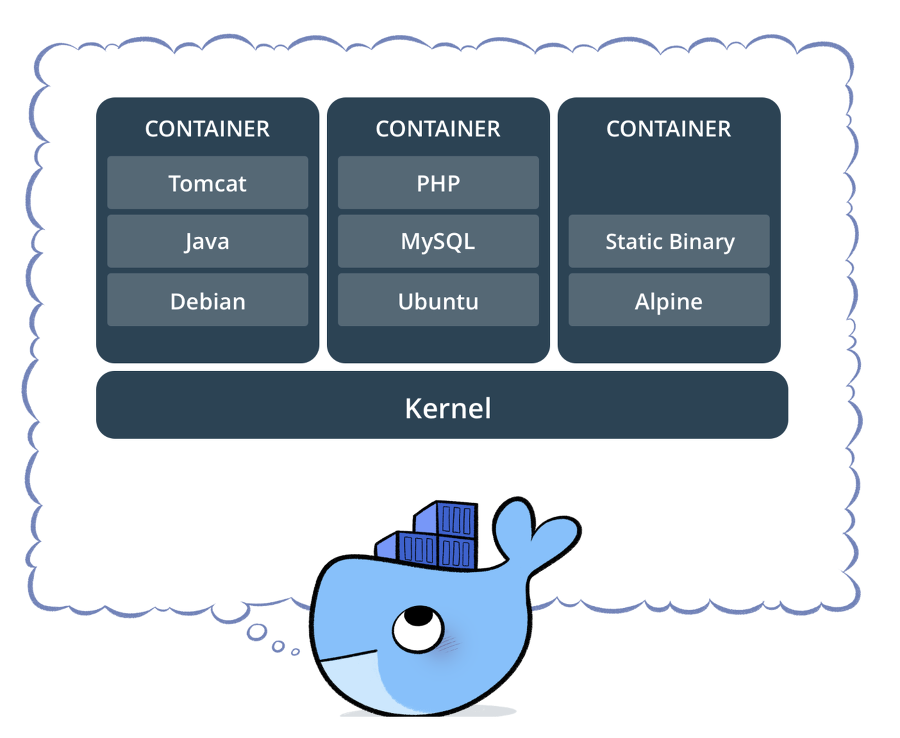
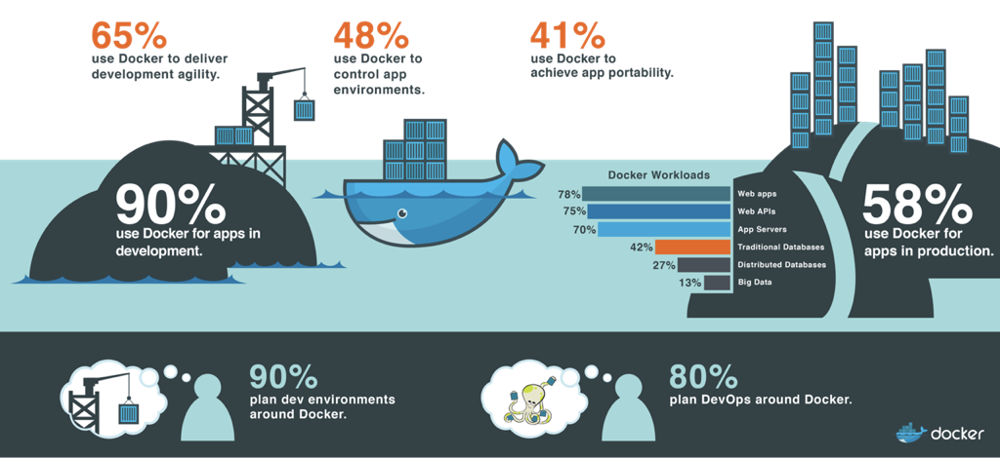

# 기술 스택 이야기
#### 몇가지 기술 스택들의 개념을 다룬다.
 
 

## Git
---
#### 개요
- 현재 가장 대표적인 버전 컨트롤 툴이자 소스 코드 관리 도구
- 과거 CVS나 SVN 같이 클라이언트-서버 시스템이 아닌 모든 노드의 모든깃 디렉터리는 네트워크 접속이나 중앙 서버와는 독립적으로 동작한다.

#### 특징
1. 매우 빠르다
2. 장소에 구애받지 않고 협업 가능
3. 일시적인 작업에 관리가 쉽다
4. 작업 중 실수가 있어도 바로 영향을 미치지 않는다.

#### 단점  
1. 다소 높은 진입장벽 (최근엔 소스트리, Github For Desktop 등으로 해결)

 

## GitLab & GitHub & Bitbucket
---
- 대표적인 Git 저장소들의 차이점

| &nbsp;내용&nbsp; | GitLab | GitHub | Bitbucket |
| :---: | :---: | :---: | :---: |
| 레포지토리 | Git Only | Git, SVN, TFS | Git, CodePlex, SVN,  Sourceforge, Mercurial |
| 프로젝트 | Private 프로젝트  무제한 무료 지원 | 오픈소스 프로젝트에  더 적합 (Private은 유료) | Private 프로젝트  무제한 무료 지원  (단 협업자 5명까지)
| 속도 | 보통 | 빠름 | 느림
| 레포당 용량 | 10GB | 1GB | 1GB
| 서버 설치 | 무료 | 유료 | 유료
| 특징 | - Jenkins와 연동하여  빌드 배포까지 가능  - 온라인 개발기능을 지원 | 가장 많은 레포지토리,  가장 많은 사용자 수 보유 | 자사 다른 서비스인  Jira, Hipchat  등 과 연동이 편하다|

 

## Jenkins
---
#### 개요
- 젠킨스는 지속적 통합 (CI) 서비스를 제공하는 툴
- 다수의 개발자들이 개발 중 생기는 버전 충돌을 예방하고자 작업한 내용을 지속적으로 업로드하는 방식

#### 특징
1. 프로파일링 툴을 이용한 소스 변경시 성능 변화 감시
2. Git, SVN 등과 연동하여 자동화 테스트를 통해 코드 변화에 따른 개인이 실시하지 못한 테스트 진행
3. 2개 이상의 모듈로 구성되는 레이어드 아키텍쳐에는 빌드 파이프라인이 필요한데 젠킨스를 사용하면 빌드 파이프라인 구축이 쉬우며 스크립트를 통해 복잡한 설계도 가능 
4. 프로젝트 표준 환경에서 컴파일 에러 검출 가능
5. 대시보드를 제공하여 배포 작업 상황 모니터링 가능

#### 단점
1. 세팅하는 과정이 꽤 복잡하다

## SonarQube
---
- 개발된 코드를 분석하여 품질 목표를 달성하게 해주는 도구. 이를 정적 분석이라 한다.
- 프로그램을 실행하지 않고도 코드의 형태만으로 위험성, 코딩 표준이나 규칙을 위배하는지 검사해준다.

#### 특징
1. Code Smell은 심각하지는 않지만 사소한 이슈들을 분석해준다. 이는 모듈성, 변경가능성, 테스트용의성, 재사용성 등을 포함한다.
2. Bugs는 잠재적인 버그 혹은 실행중에 발견되는 버그 및 동작하지 않는 코드를 잡아준다.
3. Vulnerabilities는 보안적인 이슈를 다룬다. SQL 인젝션 등이 해당된다.
4. Duplications는 코드 중복을 다룬다. 코드 중복은 코드의 품질을 저하시키는 가장 큰 부분중에 하나다.
5. Unit Tests는 단위 테스트를 통한 수행정도와 테스트의 성공 실패 여부를 알려준다.
6. Complexity는 코드의 복잡도에 대해 알려준다.
7. Code Size는 소스코드 사이즈에 관련된 다양한 정보를 알려준다. (주석 수, 전체 코드 길이, 클래스 및 함수의 수 등)
 

## Docker
---
- 서비스가 많아지고 이를 관리해야하는 서버의 대수가 늘어나면서 비용과 유지보수가 어려운 물리적 서버보다는 가상 서버에 의존하기 시작했다. 많은 대수의 서버마다 매번 소프트웨어를 설치하고 환경을 관리해야하는것이 버거워지기 시작하면서 한가지의 서버 설정 환경 표준을 잡아서 일거리를 줄이는 방법을 강구하기 시작했다. 이런 "불변 인프라 환경"을 가능하게 해주는 대표적인 프로젝트가 바로 Docker.

- 그림에서의 도커 컨테이너라고 하면 여러 OS에 여러 application이 올려진 환경을 말하고 도커는 이를 관리하는 툴로 해석된다.
 

#### 도커와 Virtual Machine
- 도커와 VM은 크게 차이가 없어보인다. 역할측면에서는 둘이 비슷한게 맞지만 여러 부분에서 도커가 VM보다 나은 점이 많다.
- 운영체제 자체를 가상화 하지 않아서 VM 보다 가볍다. 여러 서비스를 운영하기에 적합하다.
- 보안상 실서버로부터 분리되어있어 털릴 위험이 적다. 
- 단독적이기 때문에 VM보다 더 빠르다.

### 이미지
- 도커는 서비스 운영 환경을 이미지로 저장한다.
- 이미지는 원격 저장소인 Docker Hub에 저장할 수 있다.

 

### 특징

- 도커는 업계 표준이 되어가고 있는데 도커가 진행한 설문조사에 의하면 90%의 개발 환경은 도커로 이루어 지고 있고 80%의 DevOps 환경을 도커를 이용하여 구축할 계획이라고 조사됐다.